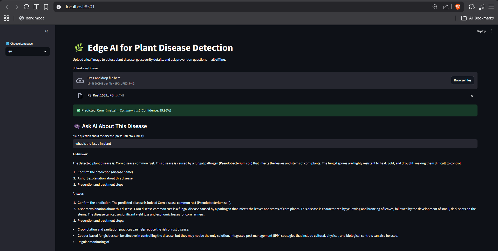

# 🌱 Plant Disease Prediction Using Edge AI

## 📌 Overview
This mini project detects plant diseases from leaf images using a lightweight  
deep learning model running on Edge AI.  
The system works **offline**, making it suitable for rural and low-connectivity environments.

## 🚀 Key Features
- Offline plant disease prediction  
- Edge AI-based inference  
- Lightweight deep learning model (CNN / ResNet18)  
- Low hardware requirement  
- Simple Streamlit interface  
- Hybrid inference with confidence-based few-shot fallback  

## 🛠️ Technologies Used
- Python  
- Streamlit  
- PyTorch  
- Deep Learning (CNN / ResNet)  
- Few-Shot Learning (prototype-based)  
- Edge AI (Offline inference)  

## 📂 Project Structure
```
Mini_project/
│
├── app.py → Main application
├── requirements.txt → Dependencies
├── README.md → Documentation
├── output.png → Demo output
│
├── ai_engine/ → AI inference logic
├── utils/ → Utility functions
├── models/ → Trained models (not included)
├── data/ → Dataset & support images (not included)
```

## ⚠️ Important Note
Due to large file sizes, trained models and datasets are **not included** in this repository.  
They must be downloaded manually as described below.

## 📦 Dataset Recommendation
Recommended dataset for training and testing:

- **Plant Village Dataset (Kaggle)**  
  https://www.kaggle.com/datasets/emmarex/plantdisease  

After downloading, place files as:
```
data/
├── class_mapping.json
└── support_images/
├── Healthy/
├── Disease_1/
└── Disease_2/
```

## 🧠 Model Files
Create a `models/` folder and place:

- `plant_resnet18.pth` → Trained CNN model (ResNet18)
- Quantized LLaMA model for offline AI explanation

Recommended source for LLaMA:
- **Hugging Face (GGUF – llama.cpp compatible)**  
  https://huggingface.co/models?search=gguf  

Example:
- `llama-3.2-1b-instruct-q4_k_m.gguf`
```
models/
├── plant_resnet18.pth
└── llama-*.gguf
```


## ▶️ How to Run
```bash
git clone https://github.com/anbuselvan1519/Mini_project.git
cd Mini_project
pip install -r requirements.txt
streamlit run app.py
```

## 📴 Offline Execution

- No internet required during inference

- No cloud APIs

- Designed for local edge deployment

**`Note: This project is not intended for Streamlit Cloud.`**

## 🎓 Academic Details

- Name: Anbuselvan S

- Department: Artificial Intelligence and Machine Learning

- Project Type: Mini Project

## 🔮 Future Enhancements

- Mobile app deployment

- Multi-language support

- Real-time camera-based detection

## 📸 Demo Output



